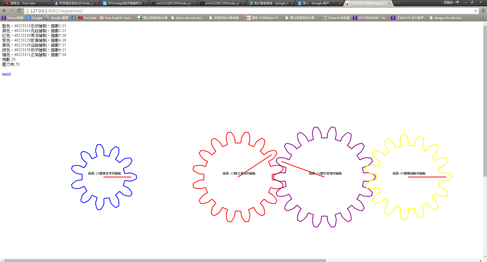

# 40223129工作日誌

#第一次工作內容
利用Creo Parametric分別測量出
當齒數(N) 模數(Module) 壓力角(系塔)
數值不同的時候會變成什麼樣齒輪

參考資料:
https://www.copy.com/browse/a:42ad970;z:copy;b:myfiles/%E5%8D%94%E5%90%8C%E7%94%A2%E5%93%81%E8%A8%AD%E8%A8%88;oid:46

#第二次工作內容

#分組報告的協同編輯
說明假如要採用"多齒輪組進行減速"的情況下,
可以有哪些數學計算公式必須透過協同分析運算的方法,
才可以確定各組員所需要提供的2D繪圖功能

1.多齒輪組進行減速
正常的減速比=從動齒輪齒數/主動齒輪齒數
※如果是*多級*齒輪減速，將所有相嚙合的一一對齒輪組的從動輪齒數/主動輪齒數，然后將得到的结果*相乘*即可獲得解答 

2.如何再增加齒輪的時候,讓齒輪能夠順利轉動?
接觸率其值不得小於 1，
否則會提高輪齒間之衝擊及增大噪音，
甚至無法運轉。接觸率愈大，則運轉愈平穩

一般來說*接觸率不得小於1.4*
接觸率(接觸比)=作用弧/周節

作用弧=SA
*S=弧長 A=面積

周節=3.14D/T
    =3.14M
*D=節徑 T=齒數

3.兩齒輪中心距如何計算
兩齒輪為*外接觸*
C=(D1+D2)/2
 =(T1+T2)*周節/2x3.14
 =(T1+T2)M/2
 
兩齒輪為*內接觸*

C=(D1-D2)/2
 =(T1-T2)*周節/2x3.14
 =(T1-T2)M/2
 
 
 #程式參考
ctx.save()
translate to the origin of second gear
ctx.translate(x_g4,y_g4)
ctx.rotate(th4)
put it back
ctx.translate(-x_g4,-y_g4)
spur.Spur(ctx).Gear(x_g4,y_g4,rp_g4,n_g4, pa, "purple")
ctx.restore()
ctx.font = "10px Verdana";
ctx.fillText("組員:29號許家瑋所繪製",x_g4-60, y_g4-10);

# m 為模數
m = '''+str(m)+'''

# 齒輪齒數
n_g4 = '''+str(ng4)+'''

# 計算齒輪的節圓半徑
rp_g4 = m*n_g4/2

一開始我是先把2D齒輪的數據調查完後，我就被分配到3D齒輪幫忙常浩
在這過程中我有參考以下網站

2D:http://cd-cadp.rhcloud.com/get_page?heading=2D%20%E8%BC%AA%E5%BB%93%E7%B9%AA%E5%9C%96

3D:http://cd-cadp.rhcloud.com/get_page?heading=3D%20%E6%AD%A3%E9%BD%92%E8%BC%AA

#期中考第八組練習
"畫齒輪,每個畫一個齒輪然後連成一條直線"
先到github然後把2015cda_g8_0421<<<<<< git clone下來
然後再把裡面的參數修改一下
即可完成個人的齒輪了

#期中考上機考試
openshift網站連結:
http://cd0427-40223129.rhcloud.com/

github網站連結:https://github.com/hn8841182/2015cd_midterm

#5/12 建立個人頁面和倉儲

Openshift:
http://cd0512-40223129.rhcloud.com/

Github:
https://github.com/hn8841182/W11

我已經將個人頁面以及倉儲顯示出來了,期中考的時候我不會的地方都有請教同學都有在時間截止前完成,那時候我們整組是一起討論一起完成的,以下是我的網址
openshift網站連結:
http://cd0427-40223129.rhcloud.com/

github網站連結:https://github.com/hn8841182/2015cd_midterm

目前剩下stl轉檔和錄成影片還沒完成

所以我給自己""15分""

#Week13
課程簡介:

完成手動組立以及自動組立
以下為參考操作步驟

Vimeo:
https://vimeo.com/129354209
