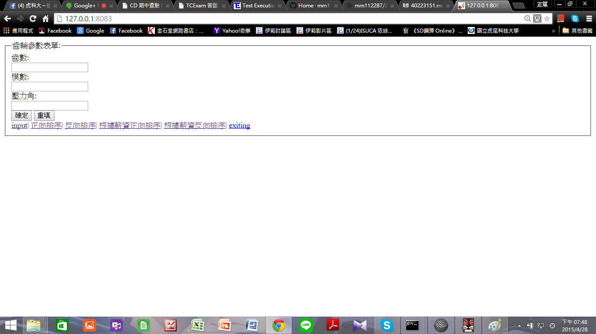
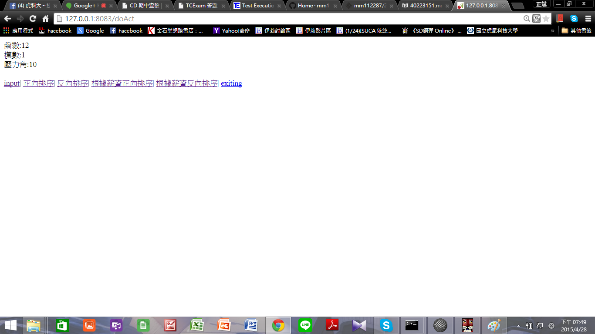
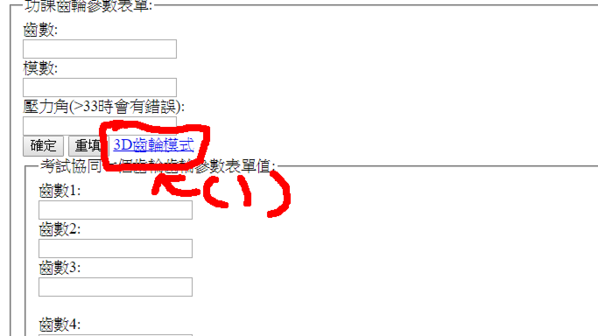

# 總結論-40223145

2015cda_g8

成員:

袁丞宗 40223124              說明整個協同考試的流程規劃

簡正斌 40223151              說明如何讓使用者輸入變數，如表單建立的方法、程式的變數輸入方法

謝俊宇 40223150              說明如何透過各組員編寫 .py 檔案, 然後讓 40223124 統一導入各                                .py 檔案並且執行後續的協同繪圖

賴涵餘 40223149              說明 Gitbook 無法即時產生電子書 pdf 的情況下, 該如何利用                                   pandoc 產生所需要的 pdf 與 html

許家瑋 40223129              說明假如要採用多齒輪組進行減速的情況下,                 
                             哪些數學計算公式必須透過協同分析運算的方法,                                                才可以確定各組員所需要提供的 2D 繪圖功
王常浩 40223110              說明 Brython 協同繪圖模式下, 與 JavaScript canvas                                          繪圖對應的相關概念與可用指令


劉兆銓 40223145              說明協同考試模擬結束後, 分組報告應該要如何寫


協同考試流程規劃:


今天期中報告,練習了之前的同步,有些指令忘記了問一下同學就記起來了
再來把github裡的程式git clone 下來,再去openshift git clone 下來做同步
,之後在複製以前的程式碼修改一些地方,儲存之後先跑跑看,看成不成功,之後就完成了


如何用Brython 協同繪圖模式下, 與 JavaScript canvas 繪圖對應的相關概念與可用指令:


我們需要在協同中繪製圖形可以與JavaScript canvas對應的相關指令，讓我們可以順利的畫出齒輪

首先先設定

<script src="/static/Cango2D.js" type="text/javascript"></script>

<script src="/static/gearUtils-04.js" type="text/javascript"></script>

將type="text/javascript"改成javascript這樣就可以在Brython協同繪圖模式執行並將畫布設定為"2d"

畫布 = document["plotarea"]

ctx = 畫布.getContext("2d")


1.畫圓
```
ctx.beginPath() 
#開始畫布
ctx.lineWidth = 3 
#線條大小為3
ctx.strokeStyle = "black" 
#線條的顏色為"黑色"
ctx.arc(250,250,50,0,2*math.pi)  
#在畫布的x=250 y=250 半徑為50
ctx.stroke() 
#結束畫布
```


2.畫直線
```
ctx.beginPath() 
#開始畫布
ctx.lineWidth = 3 
#線條大小為3
ctx.moveTo(0, 0)  
#從x=0 y=0座標
ctx.lineTo(500, 0) 
#到x=500 y=0 座標
ctx.strokeStyle = "blue" 
#線條的顏色為"藍色"
ctx.stroke() 
#結束畫布
```


3.畫圖塊，先用上面畫三角形
```
ctx.beginPath() 
#開始畫布
ctx.moveTo(20,20) 
#從x=20 y=20座標
ctx.lineTo(20,100) 
#到x=20 y=100 座標
ctx.lineTo(70,100) 
#再到x=70 y=100 座標
ctx.stroke() 
#結束畫布
ctx.fillStyle="green" 
#用綠色填滿圖形
ctx.fill() 
#全部填滿
```


備註:若要讓圖形旋轉可用旋轉指令

ctx.rotate(45 * Math.PI / 180)此為轉動45度

#分組任務_Pro/Web.Link 程式結合
```
@cherrypy.expose
def cube_weblink(self):
    outstring = '''<script type="text/javascript" src="/static/weblink/pfcUtils.js"></script>
<script type="text/javascript" src="/static/weblink/wl_header.js">
document.writeln ("Error loading Pro/Web.Link header!");
</script>
<script type="text/javascript" language="JavaScript">
// 若第三輸入為 false, 表示僅載入 session, 但是不顯示
// ret 為 model open return
 var ret = document.pwl.pwlMdlOpen("cube.prt", "v:/tmp", false);
if (!ret.Status) {
    alert("pwlMdlOpen failed (" + ret.ErrorCode + ")");
}
    //將 ProE 執行階段設為變數 session
    var session = pfcGetProESession();
    // 在視窗中打開零件檔案, 並且顯示出來
    var window = session.OpenFile(pfcCreate("pfcModelDescriptor").CreateFromFileName("cube.prt"));
    
    var solid = session.GetModel("cube.prt",pfcCreate("pfcModelType").MDL_PART);
    
    var length,width,myf,myn,i,j,volume,count,d1Value,d2Value;
    
    // 將模型檔中的 length 變數設為 javascript 中的 length 變數
    length = solid.GetParam("a1");
    // 將模型檔中的 width 變數設為 javascript 中的 width 變數
    width = solid.GetParam("a2");
//改變零件尺寸
    //myf=20;
    //myn=20;
    volume=0;
    count=0;
    try
    {
            // 以下採用 URL 輸入對應變數
            //createParametersFromArguments ();
            // 以下則直接利用 javascript 程式改變零件參數
            for(i=0;i<=1;i++)
            {
                //for(j=0;j<=2;j++)
                //{
                    myf=20.0;
                    myn=10.0+i*0.5;
// 設定變數值, 利用 ModelItem 中的 CreateDoubleParamValue 轉換成 Pro/Web.Link 所需要的浮點數值
         d1Value = pfcCreate ("MpfcModelItem").CreateDoubleParamValue(myf);
         d2Value = pfcCreate ("MpfcModelItem").CreateDoubleParamValue(myn);
// 將處理好的變數值, 指定給對應的零件變數
                    length.Value = d1Value;
                    width.Value = d2Value;
                    //零件尺寸重新設定後, 呼叫 Regenerate 更新模型
                    solid.Regenerate(void null);
                    //利用 GetMassProperty 取得模型的質量相關物件
                    properties = solid.GetMassProperty(void null);
                    //volume = volume + properties.Volume;
volume = properties.Volume;
                    count = count + 1;
alert("執行第"+count+"次,零件總體積:"+volume);
// 將零件存為新檔案
var newfile = document.pwl.pwlMdlSaveAs("cube.prt", "v:/tmp", "cube"+count+".prt");
if (!newfile.Status) {
    alert("pwlMdlSaveAs failed (" + newfile.ErrorCode + ")");
}
//} // 內圈 for 迴圈
            } //外圈 for 迴圈
            //alert("共執行:"+count+"次,零件總體積:"+volume);
            //alert("零件體積:"+properties.Volume);
            //alert("零件體積取整數:"+Math.round(properties.Volume));
        }
    catch(err)
        {
            alert ("Exception occurred: "+pfcGetExceptionType (err));
        }
</script>
'''
    return outstring
```


說明假如要採用多齒輪組進行減速的情況下, 可以有哪些數學計算公式必須透過協同分析運算的方法,  才可以確定各組員所需要提供的 2D 繪圖功能


1.多齒輪組進行減速
正常的減速比=從動齒輪齒數/主動齒輪齒數
※如果是*多級*齒輪減速，將所有相嚙合的一一對齒輪組的從動輪齒數/主動輪齒數，然后將得到的结果*相乘*即可獲得解答 


2.如何再增加齒輪的時候,讓齒輪能夠順利轉動?
接觸率其值不得小於 1，
否則會提高輪齒間之衝擊及增大噪音，
甚至無法運轉。接觸率愈大，則運轉愈平穩

一般來說*接觸率不得小於1.4*
接觸率(接觸比)=作用弧/周節


作用弧=SA
*S=弧長 A=面積


周節=3.14D/T
    =3.14M
*D=節徑 T=齒數


3.兩齒輪中心距如何計算
兩齒輪為*外接觸*
C=(D1+D2)/2
 =(T1+T2)*周節/2x3.14
 =(T1+T2)M/2
 
兩齒輪為*內接觸*

C=(D1-D2)/2
 =(T1-T2)*周節/2x3.14
 =(T1-T2)M/2
 
 
 #程式參考
ctx.save()
translate to the origin of second gear
ctx.translate(x_g4,y_g4)
ctx.rotate(th4)
put it back
ctx.translate(-x_g4,-y_g4)
spur.Spur(ctx).Gear(x_g4,y_g4,rp_g4,n_g4, pa, "purple")
ctx.restore()
ctx.font = "10px Verdana";
ctx.fillText("組員:29號許家瑋所繪製",x_g4-60, y_g4-10);

# m 為模數
m = '''+str(m)+'''

# 齒輪齒數
n_g4 = '''+str(ng4)+'''

# 計算齒輪的節圓半徑
rp_g4 = m*n_g4/2


一開始我是先把2D齒輪的數據調查完後，我就被分配到3D齒輪幫忙常浩
在這過程中我有參考以下網站

2D:http://cd-cadp.rhcloud.com/get_page?heading=2D%20%E8%BC%AA%E5%BB%93%E7%B9%AA%E5%9C%96

3D:http://cd-cadp.rhcloud.com/get_page?heading=3D%20%E6%AD%A3%E9%BD%92%E8%BC%AA


如何讓使用者輸入變數，如表單建立的方法、程式的變數輸入方法


在表單當中 <inputtype=有分很多種輸入例如:有TEXT(文字輸入),radio(按鈕方式輸入),submit(提交輸入)
在這裡我們用了submit跟TEXT因為你用了submit所以你要給他你要重送的地方例如:你要重送到doAct所以你程式裡要有action=\"doAct
一定會有人問前面那串是什麼那是一個把我們的東西部顯示在網路上的一種程式碼像密碼傳出時一定會加上這個而假如有隱藏就會有顯現顯現的程式碼使GET

br/是換行這樣這個程式大致ok了這個程式只是表單還沒結合表單
1.意下是執行程式後的表單

2.程式執行後會跳到doAct在他下面要加上outString+="齒數:"+inp
一開始的outString是，因為回傳程式是return outString所以要打outString=後面打你要輸出字串的內容，這樣就完成簡單的程式表單架構意下是輸入變數後輸出的結果


```
#coding: utf8
import cherrypy,sys
class HelloWorld(object):
    def index(self):
        return '''<form method=\"post\" action=\"doAct\">
                    <fieldset>
                    <legend>齒輪參數表單:</legend>
                    齒數:<br />
                    <input type=\"text\" name=\"inp\"><br />

                    </select>
                    模數:<br />
                    <input type=\"text\" name=\"inp1\"><br />
                    壓力角:<br />
                    <input type=\"text\" name=\"inp2\"><br />
                    <input type=\"submit\" value=\"確定\">
                    <input type=\"reset\" value=\"重填\">
                    </form>'''+self.menuLink()
    index.exposed = True
    def doAct(self, inp=None, inp1=None, inp2=None):
        #inp 變數即為表單值, 其格式為字串
        outString = ""
        outString +="齒數:"+inp
        outString += "<br />"
        outString +="模數:"+inp1
        outString += "<br />"
        outString +="壓力角:"+inp2
        outString += "<br />"
        outString += self.menuLink()
        return outString
    doAct.exposed = True
    def default(self):
        sys.exit()
    default.exposed = True
    def menuLink(self):
        return '''
        <br />
        <a href=\"index\">input</a>|
        <a href=\"readData\">正向排序</a>|
        <a href=\"readData?rev_order=1\">反向排序</a>|
        <a href=\"readData?rev_order=0&key_num=4\">根據薪資正向排序</a>|
        <a href=\"readData?rev_order=1&key_num=4\">根據薪資反向排序</a>|
        <a href=\"exiting\">exiting</a>
        <br />
        '''
 
cherrypy.server.socket_port = 8083
cherrypy.server.socket_host = '127.0.0.1'
cherrypy.quickstart(HelloWorld())
```
2.結合齒輪程式表單第一版<br/>
(1.)操作說明式<br/>
抓老師程式下來後在 outstring =裡貼上以下程式後表單列表就完成了，而程式架構跟上面表單一樣只是我多加了reset這是可以讓你所打的程式重填，而這裡輸出參數要對應以下2D齒輪參數值這樣才能同步。
 <a href="gear">3D齒輪模式</a>這行是說a href=後面打你要連結的地方，3D齒輪模式是指名子這樣做的話就會跑出一個連結gear的按鈕以下是近端測試的結果。
 
```
 <form method=\"post\" action=\"doAct\">
        <fieldset>
        <legend>齒輪參數表單:</legend>
        齒數:<br />
        <input type=\"text\" name=\"K\"><br />

        </select>
        模數:<br />
        <input type=\"text\" name=\"N\"><br />
        壓力角:<br />
        <input type=\"text\" name=\"inp2\"><br />
        <input type=\"submit\" value=\"確定\">
        <input type=\"reset\" value=\"重填\">
        <a href="gear">3D齒輪模式</a>
    </form>
```
3.結合齒輪程式表單第二版

我把第一版的輸入值增加了一個新的表單，表單名子為考試協同七個齒輪齒輪參數表單值
:，而這個表單我把輸入參數值變更為一下的行事，因為呼應七個齒輪希望可以有本來的輸入值所以我建立了一組下拉式表單，而因為每個人都要有自己的齒輪變數所以我增加了每個組員的變數值跟2D齒輪對一的值。
齒輪表單圖示


```
<form method=\"post\" action=\"doAct\">
        <fieldset>
        <legend>功課齒輪參數表單:</legend>
        齒數:<br />
        <input type=\"text\" name=\"N\"><br />

        </select>
        模數:<br />
        <input type=\"text\" name=\"K\"><br />
        壓力角(>33時會有錯誤):<br />
        <input type=\"text\" name=\"inp2\"><br />
        <input type=\"submit\" value=\"確定\">
        <input type=\"reset\" value=\"重填\">
        <a href="gear">3D齒輪模式</a>
    </form>
        
    <form method=\"post\" action=\"mygeartest2\">
        <fieldset>
        <legend>考試協同七個齒輪齒輪參數表單值:</legend>
        齒數1:<br />
        <input type=\"text\" name=\"N\"><br />


        齒數2:<br />
        <input list="ng1" name="ng1">
        <datalist id="ng1">
        <option value="10">10</option>
        <option value="15">15</option>
        <option value="20">20</option>
        <option value="25">25</option>
        <option value="30">30</option>
        <option value="35">35</option>
        <option value="40">40</option>
        <option value="45">45</option>
        <option value="50">50</option>
        </datalist><br />
        齒數3:<br />
        <input list="ng2" name="ng2">
        <datalist id="ng2">
        <option value="10">10</option>
        <option value="15">15</option>
        <option value="20">20</option>
        <option value="25">25</option>
        <option value="30">30</option>
        <option value="35">35</option>
        <option value="40">40</option>
        <option value="45">45</option>
        <option value="50">50</option>
        </datalist><br /><br />
        齒數4: <br />
        <input list="ng3" name="ng3">
        <datalist id="ng3">
        <option value="10">10</option>
        <option value="15">15</option>
        <option value="20">20</option>
        <option value="25">25</option>
        <option value="30">30</option>
        <option value="35">35</option>
        <option value="40">40</option>
        <option value="45">45</option>
        <option value="50">50</option>
        </datalist><br />
        齒數5:<br />
        <input list="ng4" name="ng4">
        <datalist id="ng4">
        <option value="10">10</option>
        <option value="15">15</option>
        <option value="20">20</option>
        <option value="25">25</option>
        <option value="30">30</option>
        <option value="35">35</option>
        <option value="40">40</option>
        <option value="45">45</option>
        <option value="50">50</option>
        </datalist><br />
        齒數6:<br />
        <input list="ng5" name="ng5">
        <datalist id="ng5">
        <option value="10">10</option>
        <option value="15">15</option>
        <option value="20">20</option>
        <option value="25">25</option>
        <option value="30">30</option>
        <option value="35">35</option>
        <option value="40">40</option>
        <option value="45">45</option>
        <option value="50">50</option>
        </datalist><br />
        齒數7:<br />
        <input list="ng6" name="ng6">
        <datalist id="ng6">
        <option value="10">10</option>
        <option value="15">15</option>
        <option value="20">20</option>
        <option value="25">25</option>
        <option value="30">30</option>
        <option value="35">35</option>
        <option value="40">40</option>
        <option value="45">45</option>
        <option value="50">50</option>
        </datalist><br /><br />
        模數:<br />
        <input type=\"text\" name=\"K\"><br />
        壓力角(>33時會有錯誤):<br />
        <input type=\"text\" name=\"inp2\"><br />
        <input type=\"submit\" value=\"確定\">
        <input type=\"reset\" value=\"重填\">
        <a href="gear">3D齒輪模式</a>
    </form>
```
我來敘述一下表單程式的架構這個下拉式表單程式跟輸入參數值一樣要有你輸出的地點
而比較不同的地方是在這行<option value="10">10</option>這合適下拉式表單程式括號裡的10是輸入值外面的是你顯示的值
15的做法雷同10的作法依此類推打好後就會跑出下圖的圖示

```
齒數2:<br />
        <input list="ng1" name="ng1">
        <datalist id="ng1">
        <option value="10">10</option>
        <option value="15">15</option>
        <option value="20">20</option>
        <option value="25">25</option>
        <option value="30">30</option>
        <option value="35">35</option>
        <option value="40">40</option>
        <option value="45">45</option>
        <option value="50">50</option>
        </datalist><br />
```


說明如何透過各組員編寫 .py 檔案, 然後讓 40223124 統一導入各 .py 檔案並且執行後續的協同繪圖

前置作業(修改上傳的名稱):https://vimeo.com/125446875

先消化過的模擬內容用來教導組員:https://vimeo.com/125447033

在上課前一天，我們注意到老師的網站已經更新，並透漏有關期中考的相關內容，於是乎，我們組於今天晚上9點左右，相約於系上的電腦教室，一同先來模擬一下

模擬的相關內容:https://wordpress-productownermde.rhcloud.com/?p=30#more-30

於是乎，我們開始分工，還在waffle上建立相關資料


模擬協同考試－分組報告

工作項目:說明整個協同考試的流程規劃

1.組長研究考試內容

2.排定工作項目

3.組員去選工作，沒選幫他排

4.組員去執行協同報告(查資料優先)，組長協助解決困難&研究2D齒輪

5.完成協同模擬考試分組報告

6.組長建立2D參數齒輪繪圖大綱

7.組員協同建立齒輪組合

8.完成2D 網際協同繪圖


如果Gitbook 無法即時產生電子書 pdf 的情況下, 該如何利用 pandoc 產生所需要的 pdf 與 html

在這部份研究後發現其實有很多的方式可以解決gitbook無法及時產生pdf的狀況，也有幾個除了pandoc以外的軟體可以運用，而課程所選擇的是pandoc，至於跟其他方式相比的優點在哪還不太清楚還需多加研究。在學校研究pandoc時經詢問助教後發現C槽內沒有執行pandoc的相關的軟體，助教說會再與老師提出。因此這部分暫時還會完成。


