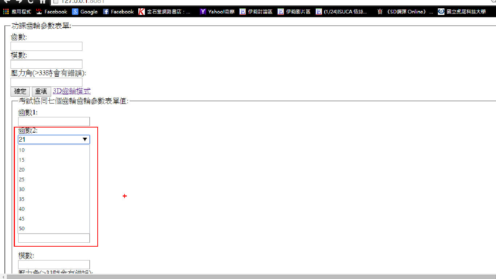

# 40223151
#分組工作內容
說明如何讓使用者輸入變數，如表單建立的方法、程式的變數輸入方法
#分組報告
## 2D 輪廓繪圖
### 分配項目:表單設計參數畫輸入

####1. 第一版表單程式設計碼


這是參考老師HTML資料所打的程式

在表單當中 <inputtype=有分很多種輸入例如:有TEXT(文字輸入),radio(按鈕方式輸入),submit(提交輸入)
在這裡我們用了submit跟TEXT因為你用了submit所以你要給他你要重送的地方例如:你要重送到doAct所以你程式裡要有action=\"doAct
一定會有人問前面那串是什麼那是一個把我們的東西部顯示在網路上的一種程式碼像密碼傳出時一定會加上這個而假如有隱藏就會有顯現顯現的程式碼使GET

br/是換行這樣這個程式大致ok了這個程式只是表單還沒結合表單
1.意下是執行程式後的表單

2.程式執行後會跳到doAct在他下面要加上outString+="齒數:"+inp
一開始的outString是，因為回傳程式是return outString所以要打outString=後面打你要輸出字串的內容，這樣就完成簡單的程式表單架構意下是輸入變數後輸出的結果


```
#coding: utf8
import cherrypy,sys
class HelloWorld(object):
    def index(self):
        return '''<form method=\"post\" action=\"doAct\">
                    <fieldset>
                    <legend>齒輪參數表單:</legend>
                    齒數:<br />
                    <input type=\"text\" name=\"inp\"><br />

                    </select>
                    模數:<br />
                    <input type=\"text\" name=\"inp1\"><br />
                    壓力角:<br />
                    <input type=\"text\" name=\"inp2\"><br />
                    <input type=\"submit\" value=\"確定\">
                    <input type=\"reset\" value=\"重填\">
                    </form>'''+self.menuLink()
    index.exposed = True
    def doAct(self, inp=None, inp1=None, inp2=None):
        #inp 變數即為表單值, 其格式為字串
        outString = ""
        outString +="齒數:"+inp
        outString += "<br />"
        outString +="模數:"+inp1
        outString += "<br />"
        outString +="壓力角:"+inp2
        outString += "<br />"
        outString += self.menuLink()
        return outString
    doAct.exposed = True
    def default(self):
        sys.exit()
    default.exposed = True
    def menuLink(self):
        return '''
        <br />
        <a href=\"index\">input</a>|
        <a href=\"readData\">正向排序</a>|
        <a href=\"readData?rev_order=1\">反向排序</a>|
        <a href=\"readData?rev_order=0&key_num=4\">根據薪資正向排序</a>|
        <a href=\"readData?rev_order=1&key_num=4\">根據薪資反向排序</a>|
        <a href=\"exiting\">exiting</a>
        <br />
        '''
 
cherrypy.server.socket_port = 8083
cherrypy.server.socket_host = '127.0.0.1'
cherrypy.quickstart(HelloWorld())
```
2.結合齒輪程式表單第一版<br/>
(1.)操作說明式<br/>
抓老師程式下來後在 outstring =裡貼上以下程式後表單列表就完成了，而程式架構跟上面表單一樣只是我多加了reset這是可以讓你所打的程式重填，而這裡輸出參數要對應以下2D齒輪參數值這樣才能同步。
 <a href="gear">3D齒輪模式</a>這行是說a href=後面打你要連結的地方，3D齒輪模式是指名子這樣做的話就會跑出一個連結gear的按鈕以下是近端測試的結果。
 
```
 <form method=\"post\" action=\"doAct\">
        <fieldset>
        <legend>齒輪參數表單:</legend>
        齒數:<br />
        <input type=\"text\" name=\"K\"><br />

        </select>
        模數:<br />
        <input type=\"text\" name=\"N\"><br />
        壓力角:<br />
        <input type=\"text\" name=\"inp2\"><br />
        <input type=\"submit\" value=\"確定\">
        <input type=\"reset\" value=\"重填\">
        <a href="gear">3D齒輪模式</a>
    </form>
```
3.結合齒輪程式表單第二版

我把第一版的輸入值增加了一個新的表單，表單名子為考試協同七個齒輪齒輪參數表單值
:，而這個表單我把輸入參數值變更為一下的行事，因為呼應七個齒輪希望可以有本來的輸入值所以我建立了一組下拉式表單，而因為每個人都要有自己的齒輪變數所以我增加了每個組員的變數值跟2D齒輪對一的值。
齒輪表單圖示


```
<form method=\"post\" action=\"doAct\">
        <fieldset>
        <legend>功課齒輪參數表單:</legend>
        齒數:<br />
        <input type=\"text\" name=\"N\"><br />

        </select>
        模數:<br />
        <input type=\"text\" name=\"K\"><br />
        壓力角(>33時會有錯誤):<br />
        <input type=\"text\" name=\"inp2\"><br />
        <input type=\"submit\" value=\"確定\">
        <input type=\"reset\" value=\"重填\">
        <a href="gear">3D齒輪模式</a>
    </form>
        
    <form method=\"post\" action=\"mygeartest2\">
        <fieldset>
        <legend>考試協同七個齒輪齒輪參數表單值:</legend>
        齒數1:<br />
        <input type=\"text\" name=\"N\"><br />


        齒數2:<br />
        <input list="ng1" name="ng1">
        <datalist id="ng1">
        <option value="10">10</option>
        <option value="15">15</option>
        <option value="20">20</option>
        <option value="25">25</option>
        <option value="30">30</option>
        <option value="35">35</option>
        <option value="40">40</option>
        <option value="45">45</option>
        <option value="50">50</option>
        </datalist><br />
        齒數3:<br />
        <input list="ng2" name="ng2">
        <datalist id="ng2">
        <option value="10">10</option>
        <option value="15">15</option>
        <option value="20">20</option>
        <option value="25">25</option>
        <option value="30">30</option>
        <option value="35">35</option>
        <option value="40">40</option>
        <option value="45">45</option>
        <option value="50">50</option>
        </datalist><br /><br />
        齒數4: <br />
        <input list="ng3" name="ng3">
        <datalist id="ng3">
        <option value="10">10</option>
        <option value="15">15</option>
        <option value="20">20</option>
        <option value="25">25</option>
        <option value="30">30</option>
        <option value="35">35</option>
        <option value="40">40</option>
        <option value="45">45</option>
        <option value="50">50</option>
        </datalist><br />
        齒數5:<br />
        <input list="ng4" name="ng4">
        <datalist id="ng4">
        <option value="10">10</option>
        <option value="15">15</option>
        <option value="20">20</option>
        <option value="25">25</option>
        <option value="30">30</option>
        <option value="35">35</option>
        <option value="40">40</option>
        <option value="45">45</option>
        <option value="50">50</option>
        </datalist><br />
        齒數6:<br />
        <input list="ng5" name="ng5">
        <datalist id="ng5">
        <option value="10">10</option>
        <option value="15">15</option>
        <option value="20">20</option>
        <option value="25">25</option>
        <option value="30">30</option>
        <option value="35">35</option>
        <option value="40">40</option>
        <option value="45">45</option>
        <option value="50">50</option>
        </datalist><br />
        齒數7:<br />
        <input list="ng6" name="ng6">
        <datalist id="ng6">
        <option value="10">10</option>
        <option value="15">15</option>
        <option value="20">20</option>
        <option value="25">25</option>
        <option value="30">30</option>
        <option value="35">35</option>
        <option value="40">40</option>
        <option value="45">45</option>
        <option value="50">50</option>
        </datalist><br /><br />
        模數:<br />
        <input type=\"text\" name=\"K\"><br />
        壓力角(>33時會有錯誤):<br />
        <input type=\"text\" name=\"inp2\"><br />
        <input type=\"submit\" value=\"確定\">
        <input type=\"reset\" value=\"重填\">
        <a href="gear">3D齒輪模式</a>
    </form>
```
我來敘述一下表單程式的架構這個下拉式表單程式跟輸入參數值一樣要有你輸出的地點
而比較不同的地方是在這行<option value="10">10</option>這合適下拉式表單程式括號裡的10是輸入值外面的是你顯示的值
15的做法雷同10的作法依此類推打好後就會跑出下圖的圖示

```
齒數2:<br />
        <input list="ng1" name="ng1">
        <datalist id="ng1">
        <option value="10">10</option>
        <option value="15">15</option>
        <option value="20">20</option>
        <option value="25">25</option>
        <option value="30">30</option>
        <option value="35">35</option>
        <option value="40">40</option>
        <option value="45">45</option>
        <option value="50">50</option>
        </datalist><br />
```


