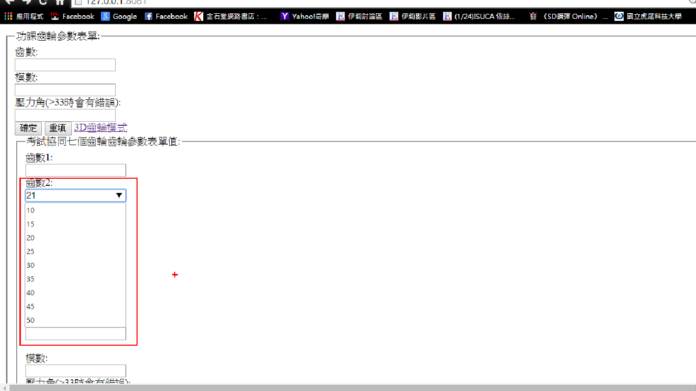

# 基礎網頁建立
##(負責人:40223151/簡正斌/七齒表單建立)

我把第一版的輸入值增加了一個新的表單，表單名子為考試協同七個齒輪齒輪參數表單值
:，而這個表單我把輸入參數值變更為一下的行事，因為呼應七個齒輪希望可以有本來的輸入值所以我建立了一組下拉式表單，而因為每個人都要有自己的齒輪變數所以我增加了每個組員的變數值跟2D齒輪對一的值。<br />
齒輪表單圖示<br />


```
<form method=\"post\" action=\"doAct\">
        <fieldset>
        <legend>功課齒輪參數表單:</legend>
        齒數:<br />
        <input type=\"text\" name=\"N\"><br />

        </select>
        模數:<br />
        <input type=\"text\" name=\"K\"><br />
        壓力角(>33時會有錯誤):<br />
        <input type=\"text\" name=\"inp2\"><br />
        <input type=\"submit\" value=\"確定\">
        <input type=\"reset\" value=\"重填\">
        <a href="gear">3D齒輪模式</a>
    </form>
        
    <form method=\"post\" action=\"mygeartest2\">
        <fieldset>
        <legend>考試協同七個齒輪齒輪參數表單值:</legend>
        齒數1:<br />
        <input type=\"text\" name=\"N\"><br />


        齒數2:<br />
        <input list="ng1" name="ng1">
        <datalist id="ng1">
        <option value="10">10</option>
        <option value="15">15</option>
        <option value="20">20</option>
        <option value="25">25</option>
        <option value="30">30</option>
        <option value="35">35</option>
        <option value="40">40</option>
        <option value="45">45</option>
        <option value="50">50</option>
        </datalist><br />
        齒數3:<br />
        <input list="ng2" name="ng2">
        <datalist id="ng2">
        <option value="10">10</option>
        <option value="15">15</option>
        <option value="20">20</option>
        <option value="25">25</option>
        <option value="30">30</option>
        <option value="35">35</option>
        <option value="40">40</option>
        <option value="45">45</option>
        <option value="50">50</option>
        </datalist><br /><br />
        齒數4: <br />
        <input list="ng3" name="ng3">
        <datalist id="ng3">
        <option value="10">10</option>
        <option value="15">15</option>
        <option value="20">20</option>
        <option value="25">25</option>
        <option value="30">30</option>
        <option value="35">35</option>
        <option value="40">40</option>
        <option value="45">45</option>
        <option value="50">50</option>
        </datalist><br />
        齒數5:<br />
        <input list="ng4" name="ng4">
        <datalist id="ng4">
        <option value="10">10</option>
        <option value="15">15</option>
        <option value="20">20</option>
        <option value="25">25</option>
        <option value="30">30</option>
        <option value="35">35</option>
        <option value="40">40</option>
        <option value="45">45</option>
        <option value="50">50</option>
        </datalist><br />
        齒數6:<br />
        <input list="ng5" name="ng5">
        <datalist id="ng5">
        <option value="10">10</option>
        <option value="15">15</option>
        <option value="20">20</option>
        <option value="25">25</option>
        <option value="30">30</option>
        <option value="35">35</option>
        <option value="40">40</option>
        <option value="45">45</option>
        <option value="50">50</option>
        </datalist><br />
        齒數7:<br />
        <input list="ng6" name="ng6">
        <datalist id="ng6">
        <option value="10">10</option>
        <option value="15">15</option>
        <option value="20">20</option>
        <option value="25">25</option>
        <option value="30">30</option>
        <option value="35">35</option>
        <option value="40">40</option>
        <option value="45">45</option>
        <option value="50">50</option>
        </datalist><br /><br />
        模數:<br />
        <input type=\"text\" name=\"K\"><br />
        壓力角(>33時會有錯誤):<br />
        <input type=\"text\" name=\"inp2\"><br />
        <input type=\"submit\" value=\"確定\">
        <input type=\"reset\" value=\"重填\">
        <a href="gear">3D齒輪模式</a>
    </form>
```
我來敘述一下表單程式的架構這個下拉式表單程式跟輸入參數值一樣要有你輸出的地點
而比較不同的地方是在這行<option value="10">10</option>這合適下拉式表單程式括號裡的10是輸入值外面的是你顯示的值
15的做法雷同10的作法依此類推打好後就會跑出下圖的圖示

```
齒數2:<br />
        <input list="ng1" name="ng1">
        <datalist id="ng1">
        <option value="10">10</option>
        <option value="15">15</option>
        <option value="20">20</option>
        <option value="25">25</option>
        <option value="30">30</option>
        <option value="35">35</option>
        <option value="40">40</option>
        <option value="45">45</option>
        <option value="50">50</option>
        </datalist><br />
```
